# AI Hybrid Assessment System - Architecture Documentation

**Owner**: Engineering Team
**Last Updated**: 2025-12-26
**Version**: 2.0
**Status**: Live / Verified

---

## 1. Overview & Purpose

### System Context
The AI Hybrid Assessment System represents a novel approach to digitizing and automating the educational evaluation lifecycle. Traditional assessment systems often lack the capability to seamlessly bridge the gap between physical (handwritten) examinations and digital processing, nor do they fully leverage Generative AI for semantic grading. This system addresses these gaps by integrating advanced Large Language Models (LLMs) with robust web technologies to facilitate exam creation, automated evaluation, and bulk digitization of offline answer sheets.

### Purpose of Documentation
The primary purpose of this architectural documentation is to provide a rigorous technical analysis of the system's design and implementation. It serves as the definitive source of truth regarding the software's structural composition, documenting the decision-making process behind key architectural choices. This document allows stakeholders to understand how the system achieves its non-functional requirements—such as scalability, maintainability, and data integrity—while strictly adhering to the separation of concerns principle.

### Intended Audience
This report is structured for an audience comprising software engineers, system architects, and academic evaluators. It assumes a fundamental understanding of distributed web systems and cloud infrastructure. The following sections detail the system's decomposition from high-level context down to code-level components, providing necessary insight for both maintenance and future scalability research.

---

## 2. Architectural Style: Modular Monolith

The software is engineered using a **Modular Monolith** architectural style. This design choice was selected to balance structural modularity with operational simplicity. In this architecture, the entire backend business logic is encapsulated within a single deployable unit—a unified FastAPI process. However, internally, the codebase is strictly organized into distinct, decoupled modules representing different business domains, such as Exam Management, Automated Grading, and User Authentication.

This approach offers distinct advantages over a distributed microservices architecture for this specific use case. Primarily, it eliminates network latency between internal services; for instance, the Exam Service can invoke the Grading Service via a direct in-process function call rather than a network HTTP request. Furthermore, it simplifies transaction management, allowing atomic database operations across different domains without the complexity of distributed two-phase commits. To ensure flexibility in the user interface, the system employs a strict **Client-Server** separation pattern. The Frontend, built with Next.js, operates as a completely independent client that communicates with the Backend strictly through defined RESTful APIs, ensuring that the user interface can evolve independently of the core business logic.

---

## 3. Architecture Decisions Records (ADRs)

| ID | Decision | Rationale | Consequences |
| :--- | :--- | :--- | :--- |
| **ADR-001** | **Use Separate Backend (FastAPI) & Frontend (Next.js)** | Decoupling allows for independent scaling and distinct development lifecycles. FastAPI provides high-performance async support needed for AI tasks. | Requires maintaining two deployment pipelines and an API contract. |
| **ADR-002** | **Deterministic Plagiarism Detection (No AI)** | `SequenceMatcher` (difflib) is O(N^2) but strictly deterministic and free. AI is overkill and costly for text-matching. | May miss "paraphrased" plagiarism that semantic AI search could catch. Accepted trade-off for cost. |
| **ADR-003** | **Sync vs Async AI grading** | Initial submissions trigger async grading to unblock the UI immediately. | Students don't see grades instantly; UI must poll or wait for refresh (Architecture handles active/pending states). |
| **ADR-004** | **Hybrid "Mock" Mode for Exam Gen** | To allow demos without burning OpenAI credits, a local fallback generator is implemented. | Adds logic branches in `ExamGeneratorService`. Must ensure Production always uses valid Keys. |
| **ADR-005** | **Local & Ephemeral File Storage** | **Teacher files** are stored locally (`/uploads`) for simplicity. **Student scans** are processed in-memory and discarded for privacy/efficiency. | **Trade-off**: Not horizontally scalable (stateful) and no audit trail for student scans. Accepted for MVP/Thesis scope; Production would use S3/Blob Storage. |

---

## 4. C4 Architecture Diagrams

### Level 1: System Context Diagram
**Goal**: Show the system's boundaries and interactions with external actors.

```mermaid
graph LR
    %% Actors
    Teacher["👩‍🏫 Teacher<br/>[User]"]
    Student["👨‍🎓 Student<br/>[User]"]

    %% System
    System["AI Assessment System<br/>[Software System]"]

    %% Externa Systems
    OpenAI["OpenAI API<br/>[External SaaS]"]

    %% Relationships
    Teacher -- "Uploads Content, Creates Exams" --> System
    Student -- "Takes Exams, Views Results" --> System
    System -- "Sends Prompts / Vision Requests" --> OpenAI

    classDef focus fill:#1168bd,stroke:#0b4884,color:#ffffff
    class System focus
```



#### Explanation
This diagram illustrates the **Big Picture**.
*   **Who uses it?**: Teachers (to create content) and Students (to take assessments).
*   **What does the system do?**: It sits in the middle, mediating all interactions.
*   **External Dependencies**: The system relies on **OpenAI** for intelligence (generation/grading).
*   **Takeaway**: This is a standalone system heavily dependent on Generative AI services.

---

### Level 2: Container Diagram
**Goal**: Show the high-level technical building blocks (independent deployables).


#### Explanation
This diagram shows **how the software is packaged and run**.
*   **Web Application**: This is the Frontend container. It serves the UI. It never talks to the DB directly.
*   **API Server**: This is the Backend container. It is the "brain" and the only component that talks to the Database or OpenAI.
*   **Database**: Provides persistent storage.
*   **Takeaway**: We have a clear separation of concerns. If the Frontend crashes, the Backend API (and ongoing grading jobs) remains alive.

---

### Level 3: Component Diagram (Backend API)
**Goal**: detailed look inside the **API Server** container to see how code is organized.


#### Explanation
This diagram explains the **internal code structure** of our Modular Monolith.
*   **Router**: The entry point for all requests.
*   **Services**: We split logic into "ExamGen", "Evaluation", and "Bulk" services. Notice `Bulk Grading` reuses `Evaluation Service`, showing code reuse.
*   **LLM Client**: A centralized client (LangChain) handles all AI calls, ensuring consistent error handling and key management.
*   **Takeaway**: The architecture emphasizes **Service Reusability** (e.g., Grading logic is central, used by both online exams and bulk uploads).

---

### Level 4: Deployment Diagram
**Goal**: Show mapping of software to infrastructure (Nodes).


#### Explanation
This diagram shows the **physical topology** where the code runs.
*   **User Device**: The student/teacher's laptop running a browser.
*   **Production Server**: A single server (or VM) running Docker Compose.
*   **Network**: The containers run inside a private Docker network. The DB port (5432) is accessible, but in a real production environment, we would lock that down.
*   **Takeaway**: Simple, self-contained deployment ideal for MPVs and pilots.

---

## 5. Interfaces & Data

### Key Data Entities (Source of Truth)
*   **Users**: (`users` table) - RBAC roles (Student, Teacher, Admin).
*   **Exams**: (`exams` table) - Configuration (Start/End time, Duration).
*   **CourseMaterial**: (`course_materials`) - PDF/Text content used for RAG/Generation.
    *   *Note*: PDF parsing is implemented (`document_processor.py`), utilizing `pypdf`.
*   **Submissions**: (`student_answers`) - The "gold" data.
    *   Linked to `evaluations` (AI Grades + Feedback).

### Data Persistence & File Storage
*   **Course Materials (Teacher Uploads)**: Stored on **Local Disk** in the `backend/uploads/` directory. The database stores the relative file path.
*   **Bulk Exam Papers (Student Uploads)**: Processed **In-Memory** (Ephemeral). The system reads the byte stream, performs OCR, extracts the text, saves the *text* to the database, and discards the image file immediately. This reduces storage costs and privacy risks.

### Critical API Contracts
*   **Auth**: OAuth2 Password Flow (JWT Tokens).
*   `POST /api/v1/exams/generate`: Accepts parameters (Count, Difficulty), returns JSON Preview. **Idempotent**: No (generates new content each time).
*   `POST /api/v1/exams/{id}/bulk-upload`: Accepts `multipart/form-data` (Images/PDFs). Returns synchronous status of upload, async processing results.

---

## 6. Non-Functional Requirements (NFRs)

### Performance
*   **Latency**:
    *   Standard API: <200ms.
    *   AI Gen/Grading: 5-30s (handled asynchronously or with loading states).
*   **Concurrency**: Designed for ~50-100 concurrent students per instance (FastAPI async workers).

### Reliability
*   **Resiliency**: The `ExamGen` service has a "Mock Fallback". If OpenAI is down or credits expire, it seamlessly switches to returning template questions so the app doesn't crash.
*   **Data Safety**: PostgreSQL runs with `restart: always` in Docker. Volume `postgres_data` persists data across container rebuilds.

### Security
*   **Auth**: OAuth2 Password Flow (JWT Tokens) - *Verified in `deps.py`*.
*   **Trust Boundary**: The API trusts the Database and OpenAI. It does NOT trust user input (Sanitized via Pydantic schemas).
*   **Secrets**: All API Keys and DB Credentials must be loaded via `.env` file. (See `app.core.config`).
*   *Note*: Email Notifications are defined in architecture but **not yet implemented** in the codebase.

---

## 7. Operational Runbook

### How to Run Locally
```bash
# 1. Start all services
docker-compose up --build

# 2. Access
# Frontend: http://localhost:3000
# Backend Docs: http://localhost:8000/docs
# Database: localhost:5432
```

### Known Failure Modes
1.  **"Quota Exceeded" (OpenAI)**:
    *   *Symptom*: Exam generation fails or returns generic mock questions.
    *   *Fix*: Check `OPENAI_API_KEY` in `.env` or check billing.
2.  **"Submission Failed"**:
    *   *Symptom*: Student gets error on submit.
    *   *Fix*: Check DB connection. Ensure `start_time` < `now` < `end_time`.

### Updates & Maintenance
*   **Database Migrations**: Run `alembic upgrade head` inside the backend container.
*   **monitoring**: View logs via `docker-compose logs -f backend`.
