```mermaid
graph LR
    %% Actors
    Teacher["👩‍🏫 Teacher<br/>[User]"]
    Student["👨‍🎓 Student<br/>[User]"]

    %% System
    System["AI Assessment System<br/>[Software System]"]

    %% Externa Systems
    OpenAI["OpenAI API<br/>[External SaaS]"]

    %% Relationships
    Teacher -- "Uploads Content, Creates Exams" --> System
    Student -- "Takes Exams, Views Results" --> System
    System -- "Sends Prompts / Vision Requests" --> OpenAI

    classDef focus fill:#1168bd,stroke:#0b4884,color:#ffffff
    class System focus
```

# Project Diagrams Reference

This document contains the source code (Mermaid) and detailed explanatory narratives for every architectural diagram in the system. These explanations are written to ensure that a reader who has never seen the application can fully understand its structure and workflow.

---

## 1. System Context Diagram (Level 1)

### Narrative Explanation
**Imagine looking at the system from 10,000 feet up.** This diagram describes the **AI Assessment System** as a black box and shows strictly who interacts with it.
*   **The Users**: On the left, we have the **Teacher**, who acts as the content creator (uploading PDFs, generating exams), and the **Student**, who acts as the consumer (taking exams).
*   **The Bridge**: The "AI Assessment System" sits in the middle. Its job is to bridge the gap between these two users. It takes the teacher's raw files and converts them into interactive exams for the student.
*   **The Brain**: On the right, you see **OpenAI**. This is crucial because our system doesn't "know" biology or physics itself. It relies on an external "brain" (OpenAI's GPT-4o) to generate questions and grade answers. This line shows that our system is dependent on an internet connection and a third-party service to function smart.

### Mermaid Code

---

## 2. Container Diagram (Level 2)

### Narrative Explanation
**Now let's open the black box.** This diagram explains the technology stack—the actual software programs running on the server.
*   **The Face (Web Application)**: The top box is what the users see. It is built with **Next.js**. Think of this as the "waiter" in a restaurant. It takes orders (clicks, inputs) from the user and shows them the menu (UI), but it doesn't cook the food.
*   **The Brain (API Server)**: The middle box is the kitchen. Built with **FastAPI (Python)**, this is where the actual work happens. When a student submits an exam, the "waiter" brings it here. This server decides if the answer is right or wrong by talking to OpenAI.
*   **The Memory (Database)**: The bottom cylinder is the refrigerator. It stores all the long-term data—user accounts, exam scores, and even the course textbooks (converted into mathematical search vectors). We use **PostgreSQL**, a robust industry-standard database.
*   **Significance**: The separation between the "Web App" and "API Server" means we can update the website design without breaking the grading logic, and vice versa.

### Mermaid Code

---

## 3. Component Diagram (Backend API)

### Narrative Explanation
**Let's look inside the "Brain" (API Server).** This diagram shows the internal assembly line of our software.
*   **The Gatekeeper (Router & Auth)**: Every request first hits the **Router**. Beside it is the **Auth Dependency**. Think of this as a security guard checking ID badges. If a student tries to access a teacher's grading panel, this component stops them immediately.
*   **The Assembly Lines (Services)**: Once inside, tasks are sent to specialized departments:
    *   **Exam Generator**: This department reads textbooks (`Fetch Material`) and asks the AI (`Prompt`) to write questions.
    *   **Evaluation Service**: This department acts as the grader. It compares student answers against the rubric.
    *   **Bulk Grading**: This is a special department for paper exams. It first sends the image to an **OCR Service** (which reads handwriting) before passing the text to the standard grader.
    *   **Analytics**: This is the reporting desk. It doesn't use AI; it just counts numbers in the database to show charts.
*   **Significance**: This structure shows that our code is "Modular". The *Bulk Grading* service reuses the *Evaluation Service*, proving that we wrote the grading logic once and reused it everywhere.

### Mermaid Code

---

## 4. Deployment Diagram

### Narrative Explanation
**Where does this actually run?** This diagram maps the software to the physical world.
*   **User Device**: This represents the student's or teacher's laptop. Notice the only thing running here is a **Web Browser**. They do not need to install any special software.
*   **Production Server**: This is the computer we control (likely a cloud server).
    *   **Private Network**: Inside this server, we created a secure "bubble" (Docker Network). The Database (Port 5432) and API (Port 8000) live inside this bubble.
    *   **Exposure**: Only the Web Container (Next.js) and API are listening for outside commands. The Database is hidden safely behind them.
*   **Significance**: This setup is "Self-Contained". We can copy this entire "Production Server" block, move it to another cloud provider (like AWS or Azure), and it would work exactly the same way.

### Mermaid Code

---

## 5. UI Flow Diagram (Screen Map)

### Narrative Explanation
**How does a user navigate the app?** This is a map of every screen in the application.
*   **The Starting Point**: Everyone starts at "Public Access". You Log In, and the system checks your role: "Are you a Teacher or a Student?".
*   **The Teacher's Path (Top Path)**: If you are a teacher, you go to the **Dashboard**. From there, you have three main jobs:
    1.  **Create Content**: Go to `My Courses` -> `Create Course` -> `AI Exam Generator`.
    2.  **Monitor**: Go to `Exams List` -> `Exam Review` to see grades.
    3.  **Analyze**: Use tools like `Cheating Detection` or `Pending Reviews`.
*   **The Student's Path (Bottom Path)**: If you are a student, your view is simpler. You go to `My Learning`. You find a course (`Browse Courses`), see the list of exams (`Course Exams`), and then—crucially—the system asks a question: **"Is the Exam Active?"**.
    *   If **No** (too early or too late): You are blocked.
    *   If **Yes**: You enter the `Take Exam Interface`.
*   **Significance**: This diagram proves we have considered the user experience (UX) and security constraints (active time checks) before writing the code.

### Mermaid Code

---

## 6. System Container Diagram (Strict)

### Narrative Explanation
This diagram is the "Source of Truth" for the system boundary. It removes any theoretical components (like Redis) and shows exactly what is running:
*   **Web App**: Next.js frontend.
*   **API**: FastAPI backend.
*   **Data**: Postgres + File Storage.
*   **External**: OpenAI (GPT-4o + Vision).

### Mermaid Code

---

## 7. Exam Engine Diagram (Ingestion & Generation)

### Narrative Explanation
Details the **Producer** workflow.
*   **Ingest**: PDF -> Parser -> Vector Store (Postgres).
*   **Generate**: Request -> RAG -> OpenAI -> Draft Exam.

### Mermaid Code

---

## 8. Assessment Engine Diagram (Online Grading)

### Narrative Explanation
Details the **Online** workflow.
*   **Autosave**: Client -> API -> DB (Draft).
*   **Grading**: Submit -> AI Service -> Grades.
*   **Review**: Teacher Override -> Audit Logs.

### Mermaid Code

---

## 8. Offline OCR & Mapping Diagram (Crucial)

### Narrative Explanation
Details the **Offline** capability using **OpenAI Vision**.
*   **Vision**: Image -> Text.
*   **Mapper**: Text + Student List -> LLM Fuzzy Match -> Mapped Answer.

### Mermaid Code

