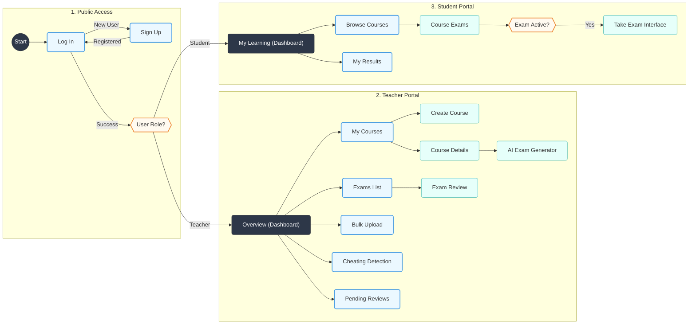

# AI Hybrid Assessment System - UI Flow Diagram (Screen Map)

**Goal**: Visualizing every single screen in the application and how they connect.

## Screen Definitions

### 1. Public Access
*   **Log In**: Entry point. Authenticates credentials.
*   **Sign Up**: Account creation.
*   **User Role?**: System logic that directs users based on their account type (Teacher vs Student).

### 2. Teacher Portal
*   **Overview**: Key statistics and recent activity.
*   **My Courses**: List of teaching subjects.
    *   **Course Details**: Upload materials (PDFs) and manage the course.
    *   **AI Exam Generator**: Configuration screen to create exams from course content.
*   **Exams List**: All scheduled and past exams.
    *   **Exam Review**: Detailed view of student performance and questions.
*   **Bulk Upload**: Offline exam processing (scan to grade).
*   **Cheating Detection**: Plagiarism analysis tool.
*   **Pending Reviews**: Queue for manual grading of low-confidence AI marks.

### 3. Student Portal
*   **My Learning**: Dashboard with "Upcoming" and "Missed" exams.
*   **Browse Courses**: Catalog of enrolled courses.
    *   **Course Exams**: List of tests available for a specific subject.
*   **Take Exam**: The timed testing environment.
*   **My Results**: History of grades and feedback.
